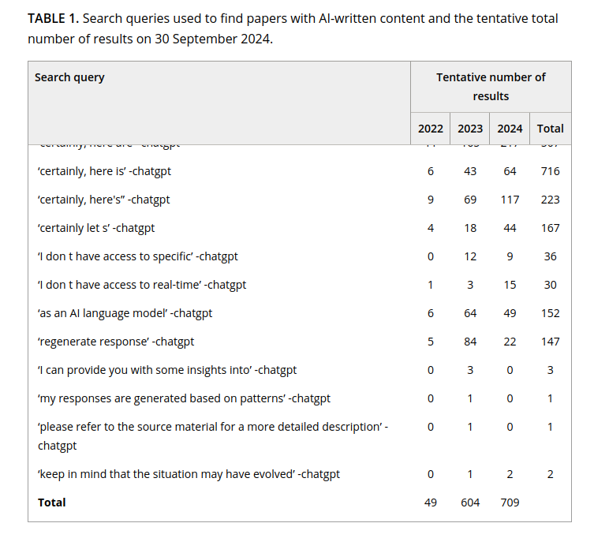
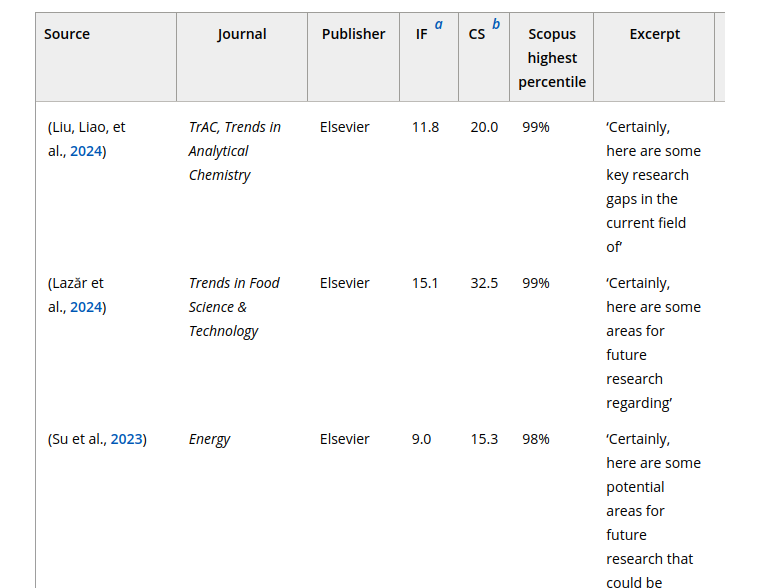

<!-- Antidote : creuser modèle -->
<!-- vérif les modèles utilisés chez Grammarly, antidote, quillbot -->

## Plan de l'atelier

Théorie :

1. Rappels sur les fondements de l'IA (30min) (AS)
2. Présentation historico-technique des systèmes de GEC (15min) (AS) 
3. Changement de paradigme : de l'ortho-typo à la reformulation voire la génération de contenu (10min) (CG + AS) 
4. Problématique : quel csq sur le travail de recherche ? (CG)
5. Changement de système de valeur : négligence dans cette étape de relecture et correction qui a des csq épistémologiques (CG) (30min avec discussion)
6. Langue = norme et normalisation politique (CG) (10min)
7. Présentation des outils (AS) (25min avec discussion)
8. conclusion/ce qu'il faut retenir (5min)

## Présentation et objectif des ateliers 

Format : 4 séances de 2heures, sans inscription, participation libre (à justifier pour le certificat des Humanités Numériques)

Théorie et pratique. 

Objectifs de la série d'atelier : 

- Comprendre les fondamentaux de l'IA et son histoire
- Obtenir des notions critiques sur le fonctionnement profond des outils
- Tester et s'approprier des outils d'IA 
- Maîtriser le vocabulaire de la discipline

Objectifs de cet atelier : 

- Cerner un cas d'usage courant des IA génératives : la correction ortho-typographique.
- S'interroger sur l'impact de ces nouvelles pratiques dans le travail de recherche.  
- Tester et comparer des outils courants. 
- Définir des critères pour effectuer un choix éclairé vis-à-vis des outils disponibles. 

## Certificat canadien en Humanités Numériques

[Information sur le certificat](https://ccdhhn.ca/)

## Qu'est ce que l'IA ? 
 
Des programmes informatiques que nous estimons à la hauteur de l'intelligence humaine ? Le développement des technologies fait évoluer cette définition de l'_intelligence_ non seulement _artificielle_ mais aussi _humaine_.

'IA' depuis 5 ans, a remplacé le 'numérique' des années 2010, et le 'cyberespace' des années 1990 et 2000.[@vitali-rosatiManifestePourEtudes2025]. 

Définition pratique pour ces ateliers: "un programme informatique qui effectue une prédiction."

## Rappels de l'introduction

- Les programmes d'IA réfèrent à des processus algorithmiques variés et pas seulement à des chatbots type ChatGPT.
- L'IA est une discipline qui a plus de 75 ans (terme de 1956). 
- [@turingComputingMachineryIntelligence1950] a orienté la discipline vers un modèle 'chatbot'.
<!-- ici expliquer Turing :  l'article Computing machinery intelligence a orienté la discipline vers une définition étroite de l'intelligence humaine comme intelligence sociale, ou capacité à feindre un échange social comme preuve d'humanité -->
- Les 'saisons de l'IA' suivent des phases d'approbation publique et de désintérêt pour le terme et les technologies qu'on place sous ce terme.
- Ce qu'on fait entrer dans la catégorie d'"intelligent" a changé : le calcul savant est-il moins intelligent que le bavardage ? 

## Rappels historiques sur l'IA

- Deux grandes approches en IA : une approche déductive (IA symbolique, système expert) vs. déductive (IA connexionniste, modèle de langue). 
- Un système expert peut être aussi complexe et énergivore qu'un LLM.
- Un LLM (_large language model_) est la modélisation sous forme de vecteurs de chaque élément d'un grand corpus (_token_ ~mot) par rapport à cet ensemble. 

[Démo visuelle](https://demo-atelier.streamlit.app/)

## Les LLMs en contexte

- Concernant les LLMs : systèmes d'IA n'ont pas de connaissance du réel ou de 'compréhension' : les réponses sont probabilistes. 
- Les hallucinations ne sont pas des anomalies, ce sont des erreurs que l'on qualifie a postériori comme telle. 
- Chatbots  = interfaces en langue naturelle : l'exploitation des capacités inductives d'un LLMs ne nécessite pas de passer par une telle interface. Ex : classification avec de l'apprentissage machine (_machine learning_). 
- Les modèles propriétaires (les vecteurs ne sont pas en libre accès) ont des intérêts économiques : nature 'sycophantique' avérée. 

## Correction automatique 

<!-- Je reste délibérément floue sur ma définition de la correction automatique pour vous amener  -->

## Présentation historico-technique des systèmes de 

- élément historiques : 
passage de système experts exemples (MT)
à modèles data-driven (SMT puis NMT sur corpus parallèle en MT) -> des modèles spécialisés dans la classification.
-> depuis 20 ans, des approches statistiques à la correction càd mise en parallèle d'une phrase en entrée et d'une phrase ou séquence présente dans le jeu de donnée. 

- LLM généraliste : même modèle que NMT donc prédiction mais pas de spécialisation sur la tâche de correction ou traduction. 

**Avant les LLM les outils de 'corrections' sont seuleemnt sur la correction ortho-typographique (on y reviendra) Maintenant les outils qui promettent de la correction dépassent les limites de la simple correction grammaticale.**

## Pourquoi est-ce que les outils incorporent ajd du 'AI powered' et quel impact sur nos pratqieus de recherches et d'enseignement

- les Systèmes existaient avant ChatGPT et opéraient de la même façon mais il fallait 
- Des nouveaux usages, un ancrage
- intérêt économique à maintenir l'utilisateur sur la même plateforme donc intégration de LLM dans l'outil. (mais probablement juste une requête). 

## La correction 

<!-- peut-être proposer des exemples, prendre son temps ? -->
- une étape négligée ou dévaluée ? quelle place dans notre système de valeurs ? 
- qu'est-ce qui entre réellement dans cette étape ? 
    - corrections orthographiques, 
    - corrections typographiques,
    - vérification de la mise en page,
    <!-- (veuve et orphelin) -->
    - traduction, 
    - vérification des sources, 
    - amélioration du style, ton. 
    - reformulation selon le lectorat pressenti (prise en compte de la situation d'énonciation)

    <!-- répétition, niveau de langue, terminologie, alléger les phrases -->
    - amélioration du contenu. 
    
La correction bibliographique : 'la barrière du dernier kilomètre' [@monjourBarriereDernierKilometre2025] 

## Quelle conséquence concrétement ?

deux points de vue : 
- La correction a un impact sur la manière dont le texte est reçu. Le pdv des outils : peaufiner pour 'convey at best' tes idées, respecter les idées de l'auteurice.
- "Écrire c'est réécrire." donc laisser la correction à la machine c'est laisser une partie importante du travail intellectuel. 
    - surtout si on considère les pratiques réelles où l'écriture est faite d'itération avec des étapes de corrections et des relectures. 
    - ce qui était rationalisé dans le monde de l'imprimé avec le système ddes 'épreuves' à al soumission d'un manuscrit. 

À quel moment est-ce que cette étape intervient ? Et quelle est la conséquence d'automatiser cette étape ? 

- au cours de la rédaction ? 
    - évanouissement des versions intermédiaires (suppression vs. versioning) ?
- à la fin de la rédaction ? 

## Changement de paradigme

de la correction ortho-typo à la reformulation au fait de masquer le fait que le texte ait été écrit par une IA. 

## L'alignement des valeurs et le système de valeurs

>« The problem of achieving agreement between our true preferences and the objective we put into the machine is called the value alignment problem: the values or objectives put into Value alignment problem the machine must be aligned with those of the human. » [@russellArtificialIntelligenceModern2022a, p. 23]

L'intelligence humaine commence là où celle de la machine s'arrête. Si on découvre de nouvelles capacités à la machine alors on enlève cette capicité de la définition de l'intelligence humaine. « More than fifteen years ago Hilary Putnam identified the old problem we face to this day: ‘The question that won’t go away is how much what we call intelligence presupposes the rest of human nature’ (1988: LET} » ([McCarty, 2005, p. 41](zotero://select/library/items/7GB6UIS6)) ([pdf](zotero://open-pdf/library/items/YYXNRKV9?page=63&annotation=CMSKVFSW))

Autrement dit, si on laisse à la machine cette tâche c'est qu'on tend à l'estimer comme peu valorisante dans notre système de valeur actuel. Quelles conséquences est-ce que déléguer cette partie du travail a sur notre travail ? 

## Des 'petites corrections finales' ?

>Currently, academic publishers only allow the use of ChatGPT and similar tools to improve the readability and language of research articles. However, the ethical boundaries and acceptable usage of AI in academic writing are still undefined, and neither humans nor AI detection tools can reliably identify text generated by AI [@homolakExploringAdoptionChatGPT2023]

<!-- pas de définition claire de la correction sur le plan académique = pas de limite non plus. 
Est-ce que refaire une table en utilisant un LLM càd en prenant le risque qu'il hallucine sur des données demande un usage cité de ChatGPT ? 
Si le contenu dépend du style, est-ce que la réécriture ne modifie pas le contenu original intellectuel ? 
Est-ce que faire un état de l'art (càd pas de production de nouveau contenu) avec chatGPT n'influence pas le travail de recherche ?  -->

>It is being increasingly observed that content generated by ChatGPT is going undeclared and undetected, resulting in its appearance in articles published in scholarly journals. 
[...] The general policy among publishers states that AI tools must not be used to create, alter or manipulate original research data and results (Elsevier., 2023; Roche, 2024).[@strzeleckiMyLastKnowledge2025]

<!-- ici l'argumentaire c'est que comme on a laissé à ChatGPT la taĉhe de rédaction et possiblement de relecture finale on s'embête pas à relire la version de l'article soumise, donc on laisse des dingueries.  -->

## Qu'est-ce que la relecture-correction ?

- correction ortho-typo
- des énoncés grammaticalement justes ⇒ la grammaire c’est que des règles de combinaison, purement syntaxique, combinatoire sans sémantique. Règles systématiques et productives. Computation de séquences.
- des énoncés qui font sens ⇒ sémantiquement correctes
- adéquation avec une situation d’énonciation ⇒ implique la pragmatique
- le style qui flirt avec les limites du correct
- la reformulation c’est encore autre chose

## Les étapes de la correction

<!-- à valider avec Clara -->

1. la lecture 
2. établir des critères de corrections : orthographes = règles de la langue, mais style etc.
3. l'annotation = proposition
4. la réécriture

## De l'importance du versionage 

Le LLM et l'interaction avec le LLM réduit les étapes de la correction au delà de son automatisation. Le LLM réécrit, il n'annote pas[^note], ne demande pas de clarifications ur les instructions données même si elles sont floues ('améliore le texte' est une instruction valide).

Un processus de suppression  qui est similaire aux logiques des éditeurs de texte WYSIWYG vs. le versionage qui rend compte du processus, entre dans une dimension de traçabilité et d'interprétabilité des choix effectués.

[^note]: on peut cependant prompter un modèle pour qu'il le fasse.

<!-- ici une illustration sur le versionage ? -->

## SOTA GEC = Grammar Error correction

Tâche de NLP voisine de la **traduction automatique**. 

Système expert : très limités pour cette tâche. Grammaire = beaucoup de règles, parfois des règles d'idiomaticité pure (des colocations fortes). 

Systèmes inductifs  ou approches _data-driven_  :

D'abord des classifieurs pour prédire le mots le plus probable dans une classe (préposition), puis statistical machine learning (STM) dans les années 2010 et particulièrement Neural machine translation (NMT). [@wangComprehensiveSurveyGrammar2020; @bryantGrammaticalErrorCorrection2023]

NMT : Correspondance entre des phrases ou portions de phrases en entrée et des portions de phrases attestées en grand nombre (seq2seq) à partir de corpus parallèle. Le modèle algorithmique est entraîné sur une paire de langue (français->anglais). 

## Traduction automatique et LLMs

Un grand modèle de langue positionne chaque mot dans un espace vectoriel lors de sa phase d'apprentissage initiale à partir d'un grand volume de données en langue naturelle. 

Afin de retrouver donner une réponse le LLM généraliste comme GPT, Mistral, Qwen, Llama, situe la requête utilisateur dans son espace vectoriel et sélectionne les tokens les plus probables à partir du contexte donné (la requête utilisateur ou _prompt_ **et** les tokens qu'il a déjà généré). 

Les LLMs sont donc généralistes, ils ne sont pas destinés à la traduction plus qu'à la correction d'erreurs grammaticales ou l'écriture créative.

Such divergences are well-documented in human translations (HT), where translators often make structural choices that vary significantly from the text originally written in the target language (Deng and Xue, 2017; Nikolaev et al., 2020). In contrast, traditional NMT outputs typically exhibit less diversity and more literal translations, lacking significant structural variation

## LLM vs NMT qualitativement

NMT + littéral, + spécialisé
LLM + verbeux (confabulation) mais plus proche de la traduction humaine pour ça. 

« We find that while LLMs often exhibit translation patterns more similar to human translations compared to traditional NMT models, they still diverge from originally authored text in the same language. Overall, we find that automatically translated sentences from both NMTs and LLMs are consistently identified with higher accuracy in O/T classification tasks than human-translated ones » [@sizovAnalysingTranslationArtifacts2024]

« Furthermore, our frequency analysis of PoS tags reveals that LLMs align more closely with HT in their usage, especially in terms of adverbs, and auxiliary verbs, while NMT models tend to overproduce specific tags in shorter sentences. This suggests that LLMs, although not perfect, are making strides in mimicking human translation patterns. » (idem)

« indicate that LLMs tend to produce translations that are less literal compared to NMT models » 

« What’s more, IBM announced the deprecation of Watson Language Translator, its NMT service, encouraging users to migrate to — guess what? — WatsonX LLMs. This move establishes IBM as one of the first tech giants to sunset its NMT efforts and focus on LLMs for automated translation purposes. » [@ciesielskiNeuralMachineTranslation2024]

## Limites exposées

- avec la MT on a 50 ans d'évaluation et de mesure statistiquues pour évaluer (score BLEU etc) mais pas avec la correction parcequ'on néglige ĉa.

- si on transpos eles ccl de l'article [@sizovAnalysingTranslationArtifacts2024 on voit que LLM = conversationnel, + idiomatique mais pas + expert ! Et surtout, les traducteurs apprécient travailler avec des NMT (!! syst neuronaux spécialisés) parce que erreurs prévisibles ! Output convainquant au premier abrood car ressemble au langue naturelle mais erreurs plus subtiles plus difficile à détecter. 

## Le futur de la traduction automatique

We anticipate that, soon, LLMs will become a viable enterprise solution for translation. This will likely come when we move towards task-specific LLMs trained specifically for translation. These models will be smaller and more practical to deploy and maintain than today’s massive foundational models. [@ciesielskiNeuralMachineTranslation2024]

## Back to GEC 

Lectures à faire : 

@kobayashiLargeLanguageModels2024; @maityHowReadyAre2024

Kobayashi, M., Mita, M., & Komachi, M. (2024). Large Language Models Are State-of-the-Art Evaluator for Grammatical Error Correction (No. arXiv:2403.17540). arXiv. https://doi.org/10.48550/arXiv.2403.17540

Maity, S., Deroy, A., & Sarkar, S. (2024). How Ready Are Generative Pre-trained Large Language Models for Explaining Bengali Grammatical Errors? (No. arXiv:2406.00039). arXiv. https://doi.org/10.48550/arXiv.2406.00039

## Avant présentation outils 

6. Langue = norme et normalisation politique (Clara)

## Outils généralistes

LLMs non entraînés : ChatGPT, modèles téléchargés localement (ollama). 

- trad auto : comparaison montre que les llm généraliste sosnt conversationnels mais pas experts. Influence du prompt (à base d'exemple, description de la tâche). 

<!-- interprétation donnée ChainForge -->

- des modèles 'généraliste' avec une forte préférence pour l'anglais : quelle place pour les formes dialectales, pour les langues minoritaires. ?

Càd qu'un LLM est toujours orienté. 

## Outils spécialisés (correction, écriture académique)

https://www.editpad.org/ : AI detector, humanize AI text, Plagiarim checker, paraphrasing tool, story generator, text summarizer, AI essay writer etc. Probablement juste ChatGPT hooked à une interface avec un system-prompt. Apparamment mauvais according to @bordalejoScarletCloakForest2025

 

maintenant corriger = masquer que le texte ne vient pas d'un humain, ou chercher à le détecter

[https://www.writefull.com/](https://www.writefull.com/)

Effet de mode = disparition et apparition de solutions miracles 

[Grammarly](https://www.grammarly.com/) donne une note à partir des critères de formalité, 4 niveaux : correctness (corrige erreurs grammaticales), clarity (reformulation) engagement(option payante), delivery (payant), plagiarism detection (payant). Avec un 'generative AI' avec des prompts pre-écrit.
-> un browser plugin qui permet de s'en servir avec tous les sites google (docs, gmail, youtube comments). 

'improve' is an option of Generative AI. As is, just 'improve'.

"Grammarly is the AI communication partner trusted by over 40 million people, 50,000 organizations, and people at 96% of the Fortune 500."

[quillbot](https://quillbot.com/)

Is QuillBot considered AI writing?

    2 years ago Updated 

Everyone’s talking about AI writing these days, and debate over its use — and misuse — rages. QuillBot has helped you grow and improve as a writer, but you may wonder if using it is considered AI writing. Good question. **The short answer is “no.” QuillBot’s tools have specific uses, such as correcting grammar or paraphrasing sentences. It’s up to you to use the feedback and suggestions to create content that is solely your own.** ChatGPT and similar AI writers, on the other hand, can generate essay-length text from a few prompts. That writing can then be presented with no changes. Since QuillBot is not considered AI writing, most plagiarism checkers will not flag its use.

That said, we make no guarantees if someone uses QuillBot on text generated by a tool like ChatGPT. Why not play it safe and craft the content yourself? (With QuillBot’s help, of course!)

Antidote : https://www.antidote.info/fr/blogue/nouvelles/reformulation-et-intelligence-artificielle-antidote

Des choix 

ProLexis 

## Interrogation 

Est-ce que ces outils sont vraiment spécialisés ? Et comment le sont-ils ? 

il semble que les options de 'generative AI' sont simplement des prompts envoyés à un LLM via une API, ces outils ne possèdent pas forcément 'leur modèle', sinon ils ont fait du fine-tuning. Si l'utilisation du LLM est orientée par les dev du logiciel, il s'agit bien du même processus (l'utilisateurice peut seulement choisir une 'reformulation' du ton par exemple).

Les avantages possibles qu'il pourrait y avoir : la sécurité des données (prompts cryptés) mais ce n'est même pas amené. 

On voit que les outils se dirigent vers la 'détection du plagiat' et de la détection du l''utilisation d'IA' : est-ce que on est dans unelogique de correction ou pas plut^to une logique de maquillage d'usages considérés par les maison d'édition et les universités comme illégitimes ?

<!-- en fait toutes les applications de texte ajd propose de l'IA : Evernote, Notion, ont des options de générative AI pour la correction et parfois pour la génération de texte. Avec par exemple Evernote qui ajoute du RAG -->

# Quelle évaluation des corrections ou des modèles ? 

Formaliser une méthodologie pour l'évaluation : 

critères :  

- évaluation quantitative 
- évaluation qualitative 

