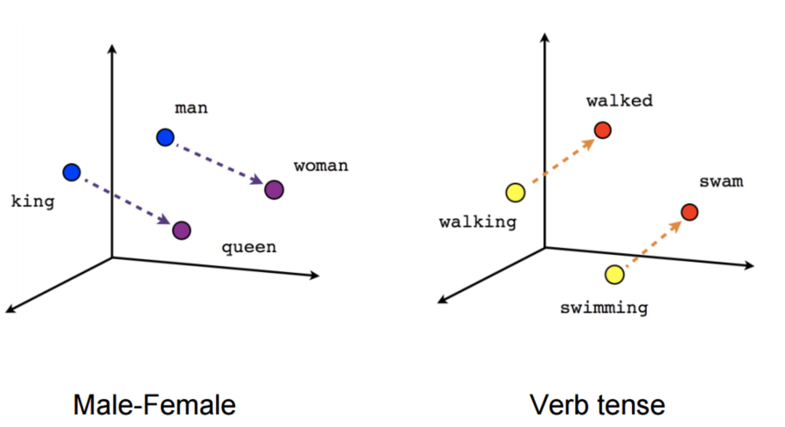
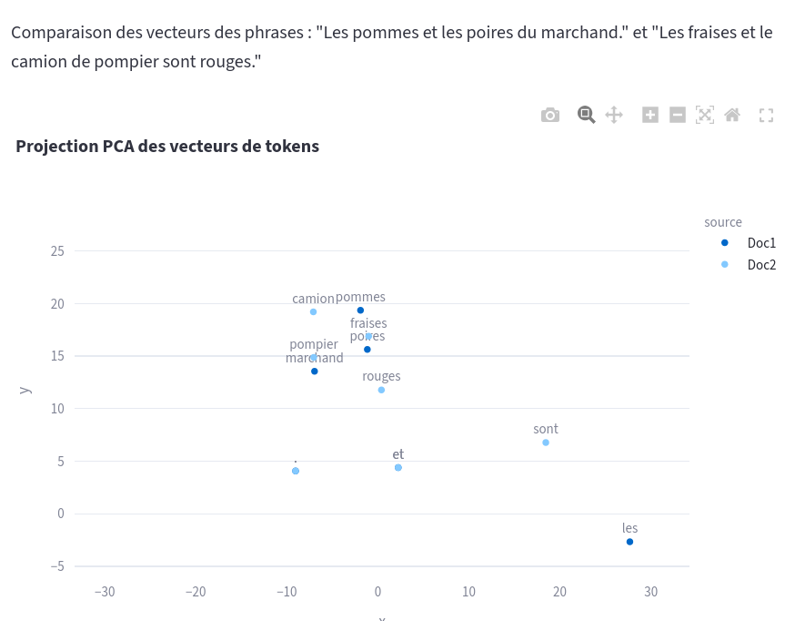
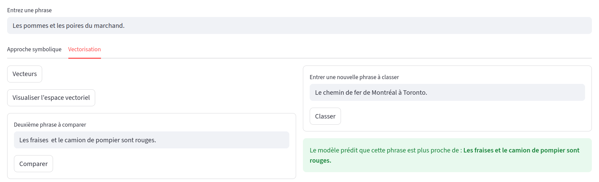
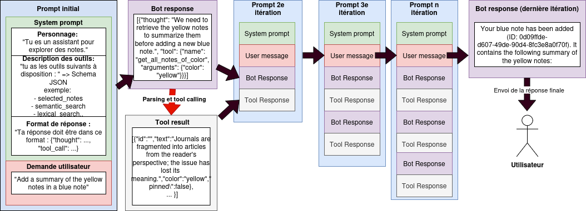
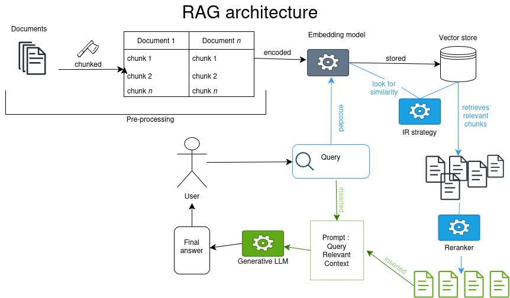
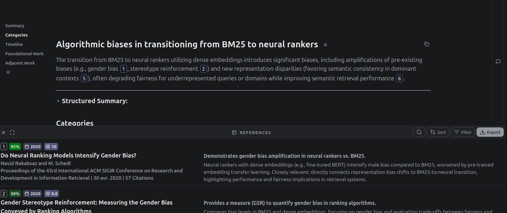

## Programme de la séance 

<!-- ouvrir splat1.html, 
ouvrir le splat1  à combinedScore pour changer poids de la recherche hybride
ouvrir splat1 à  tools pour montrer les fonctions  -->

1. Introduction et rappels
2. Les systèmes complexes intégrant de l'IA: les agents IA
3. le RAG
4. RAG et applications généralistes
5. Les Assistants de recherche 'AI powered'

## Présentation et objectif des ateliers 

Format : 4 séances de 2heures, sans inscription, participation libre (à justifier pour le certificat des Humanités Numériques)

1h à 1h30 de théorie + 30 minutes à 1h d'échanges.

Objectifs de la série d'atelier : 

- Comprendre les fondamentaux de l'IA et de son histoire
- Obtenir des notions critiques sur le fonctionnement profond des outils
- Cerner les enjeux actuels sur des thématiques qui affectent la recherche et l'enseignement

## Certificat canadien en Humanités Numériques

[Information sur le certificat](https://ccdhhn.ca/)

# Les fondamentaux : rappels 

## Qu'est ce que l'IA ? 
 
Des programmes informatiques que nous estimons à la hauteur de l'intelligence humaine ? Le développement des technologies fait évoluer cette définition de l'_intelligence_ non seulement _artificielle_ mais aussi _humaine_.

'IA' depuis 5 ans, a remplacé le 'numérique' des années 2010, et le 'cyberespace' des années 1990 et 2000.[@vitali-rosatiManifestePourEtudes2025a]. 

Définition pratique pour ces ateliers: "un programme informatique qui effectue une prédiction."
## Rappels de l'introduction

- Les programmes d'IA réfèrent à des processus algorithmiques variés et pas seulement à des chatbots type ChatGPT.
- L'IA n'est pas une nouvelle discipline (terme de 1956 lors de la Dartmouth Summer Research Project on Artificial Intelligence par Marvin Minsky et John McCarthy). 
- L'article _Computing Machinery and Intelligence_ de @turingComputingMachineryIntelligence1950 a orienté la discipline vers un modèle 'chatbot'.
<!-- ici expliquer Turing :  l'article Computing machinery intelligence a orienté la discipline vers une définition étroite de l'intelligence humaine comme intelligence sociale, ou capacité à feindre un échange social comme preuve d'humanité -->
- Les 'saisons de l'IA' suivent des phases d'approbation publique et de désintérêt pour le terme et les technologies associées.
- Ce qu'on fait entrer dans la catégorie d'"intelligent" a changé : le calcul savant est-il moins intelligent que le bavardage ? 

## Rappels historiques sur l'IA

- Deux grandes approches en IA : une approche déductive (IA symbolique, système expert) vs. approche inductive (IA connexionniste, modèle de langue basé sur des plongements de mots ou _embeddings_ = vecteurs). 
- Un système expert peut être aussi complexe et énergivore qu'un LLM.
- Un LLM (_large language model_) est la modélisation sous forme de vecteurs de chaque élément d'un grand corpus (_token_ ~mot) par rapport à cet ensemble. 

## Les LLMs en contexte

- Pour les LLMs, la 'compréhension' du monde n'est basée sur aucun référent ou aucune règle définie : **les réponses sont probabilistes**, elles sont donc plausibles et convaincantes parce qu'elles donnent plus de chance à des tournures de phrases courantes dans leur jeu d'entraînement.
- Les hallucinations ne sont pas des anomalies, ce sont des erreurs que l'on qualifie a posteriori comme telle. 
- Après l'apprentissage de son corpus d'entrainement, une étape de _reinforcement learning_ donne une saveur ou personnalité à un modèle.
- Les LLMs reflètent les intérêts économiques des  concepteurices des applications qui les intègrent : nature 'sycophantique' avérée. 
- On peut influencer le calcul de probabilité d'un modèle (température, top-k, seed) et donc sa personnalité (déterministe vs. créatif). 
- On peut aussi 'orienter' le comportement d'un modèle avec un _system prompt_ sans modifier les embeddings ou l'algorithme de prédiction.
- Chatbots  = interfaces en langue naturelle : l'exploitation des capacités inductives d'un LLMs ne nécessite pas de passer par une telle interface. Ex : classification avec de l'apprentissage machine (_machine learning_). 

# Des systèmes d'IA complexes

## Quelle complexité ?

IA, dite générative ou d'automatisation de la prédiction de token, effectue aujourd'hui des tâches complexes à deux niveaux: 

- interprétation d'une instruction donnée en langue naturelle (avec son lot d'ambiguïté).
- **intégration** de LLM dans des process ou pipelines qui impliquent des interactions en chaînes: 

    - Systèmes agentiques "_agentic AI_"
    - RAG

## Exemple de système d'IA complexe: les agents

- un agent est une série d'appels à un LLM : l'agent est ce qui permet d'enchaîner input et output jusqu'à complétion d'une tâche. 

Autrement dit, **un agent est une "IA" qui se répond à elle-même.**

On parlera de système agentique quand plusieurs agents interagissent.

Demonstration d'un système agentic: assistant à l'exploration et la création de note sur un tableau interactif. 

<!-- idée: - performativité du langage : la réponse du modèle devient action (tool call) -->

## Définitions hypée des IA agentiques

![Description des IA agentiques par Docker [@irwinGenAIVsAgentic2025]](img/genai_v_agenticai.png)

## Schéma de l'agent conversationnel de la démo

## Applications de chat actuelles

ChatGPT et consort sont des applications qui utilisent un LLM (la représentation figée de la langue en vecteurs) pour faire de la prédiction de tokens (génération). 
Depuis GPT-3.5 et sa sortie publique en décembre 2022, l'application ChatGPT ne se contente pas d'envoyer seul le prompt de l'utilisateur pour interroger le LLM: dans le prompt global, on trouve un ensemble d'instructions préliminaires (le _system prompt_) et d'informations complémentaires comme l'historique des échanges (_chat history_). 

Depuis décembre 2024, la fonction _search_ permet de lancer une requête sur internet => **RAG**

# Recherche d'information et synthèse des sources

## Retrieval Augmented Generation

Limites du LLM: 

- représentation figée sur les données d'entraînement (= mémoire implicite ne peut pas être mise à jour)
- fenêtre contextuelle limitée (ajd jusque 120 000 tokens, en réalité déclin après ~30 000 tokens) 

-> perte de fiabilité

Le RAG : architecture de système d'IA qui repose sur une base de connaissance externe dans le but d'améliorer les réponses d'une IA générative sans demander d'entrainement supplémentaire (_fine tuning_).[@lewisRetrievalAugmentedGenerationKnowledgeIntensive2021] (Facebook, University College London, New York University)

---

## RAG en bref

Requête d'une base de données[^note] avec des vieilles méthodes de Recherche d'Information éprouvées (TF-iDF ou similarité cosinus) + intégration des morceaux extraits au prompt. Le LLM effectue une synthèse 

[^note]: ou d'un moteur de recherche

## Points d'attention sur le RAG

- Jeux de données externes peut aussi être biaisé,
- Ajout de couches d'interprétation,
- Dissémination de l'information: l'information se trouve dans plusieurs chunks
- Angles morts: information importante dans un chunk non extrait

# RAG des applications généralistes

## ChatGPT

> We collaborated extensively with the news industry and carefully listened to feedback from our global publisher partners, including Associated Press, Axel Springer, Condé Nast, Dotdash Meredith, Financial Times, GEDI, Hearst, Le Monde, News Corp, Prisa (El País), Reuters, The Atlantic, Time, and Vox Media. Any website or publisher can choose to appear⁠(opens in a new window) in ChatGPT search. If you’d like to share feedback, please email us at publishers-feedback@openai.com⁠.
> --- @openaiIntroducingChatGPTSearch2024

1. Reformulation de l'entrée utilisateur en une ou plusieurs requêtes
2. Requêtes envoyées à Bing et Shopify[^source] et sur leur base de données interne (médias partenaires). 
3. Re-ranking ? 
4. Réponse généré depuis le prompt contenant les informations extraites (+ system prompt, chat history etc.) 

[^source]: https://help.openai.com/en/articles/9237897-chatgpt-search#h_e40ba06c5b

## Le Chat de Mistral

Partenariat avec l'AFP depuis janvier 2025 [@afpAFPMistralAI2025]. Opacité quant à la méthode de recherche d'information sur internet[^mistral]

[^mistral]: https://docs.mistral.ai/agents/tools/built-in/websearch

# Assistants de recherche AI ou _AI-powered search engine_

## Intro

Foisonnement d'assistants de recherche, ou de lit review assistants. 

- Google Scholar Labs (décembre 25)
- SemanticScholar 
- JSTOR 
- Primo Research Assistant (spécialisé bibliothèque)
- Web of Science Research Assistant
- Scopus AI 
- scite.ai
- undermind.ai
- reLIS de l'Udem : @bigendakoModelingToolConducting2026

Qu'est-ce qu'on entend par IA dans ce cas ? 

## Expansion de requête

1. Méthodes sans IA : thésaurus, ontologies

2. _Query expansion_ avec un LLM: "Écrit 10 variants de la requête suivantes"

## Méthodes de Recherche d'information 

1. Méthodes classiques (non IA ?): 
    - recherche booléenne: ET/OU
    - recherche par caractère[^regex] : '**citation**' retourne 'The decrease in uncited articles and its effect on the concentration of **citation**s'
    - recherche lexicale: TF-iDF et BM25 -> correspondance d'un terme par rapportaa à sa présence dans le corpus. <!-- explique mieux -->

2. Recherche sémantique (_semantic search_/_dense retrieval_) utilisation des plongements lexicaux de modèles types encodeur (BERT) ou décodeur (e.g. GPT) lors de la recherche: représentation vectorielle de la requête et de l'entièreté de la base de données -> mesure de similarité cosinus.

-> Impact sur la manière de requêter: 1. par mot-clé, 2. 'en langue naturelle'. 

[^regex]: et regex!

## Reranking

Possiblement du ML classique ou un algorithme sur mesure (ex: semantic Scholar 'emphasize )

## Enrichissement de résultats

Ex: Google Scholar Labs

## Synthèse des articles 

_Deep research_ : revue de littérature complète à partir de plusieurs itérations (IA agentique)

ex: undermind.ai

[source](https://app.undermind.ai/report/96d1ce264f5b976eac434514d16e2529a99968d6928b225d57859617b14beca1)

## Overview par Aaron Tay

![Synthèse des outils d'IA [@tayWhatWeActually2025]](img/Tay_synthese_researchAssistant.png)

# Discussion

## Annonces

Prochains ateliers débogue: 

**Le matériel informatique : trésor ou ordure ?**
> **29 janvier, même heure même lieu**
> Rester à la fine pointe de la technologie, ça coûte cher. Mais est-ce même utile ? Est-ce que ça se fait de seulement remplacer la batterie de son ordinateur, ou un disque pour rendre sa machine plus rapide ? C’est souvent plus facile qu’on le pense ! Avec cette démo, on vous aide à garder votre machine plus longtemps, et votre argent dans vos poches ! 

**Documentation des nouvelles pratiques liées à l’utilisation de l’IA : préconisations pour les SHS**
>**12 mars, même heure même lieu**

## Références

