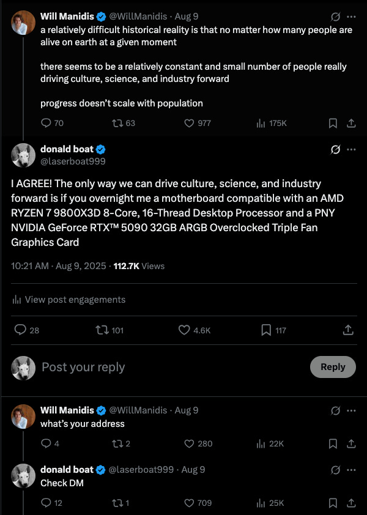
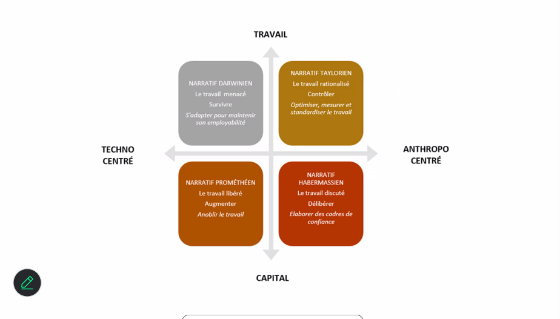
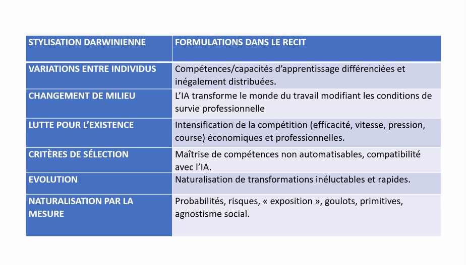
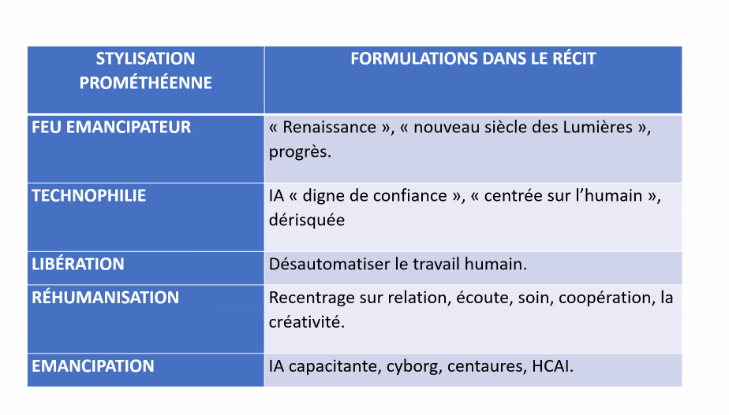
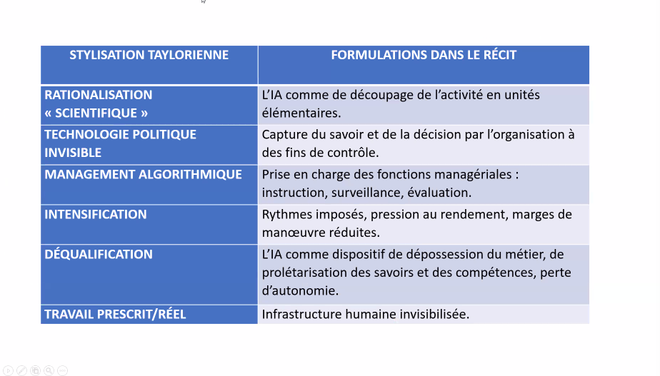
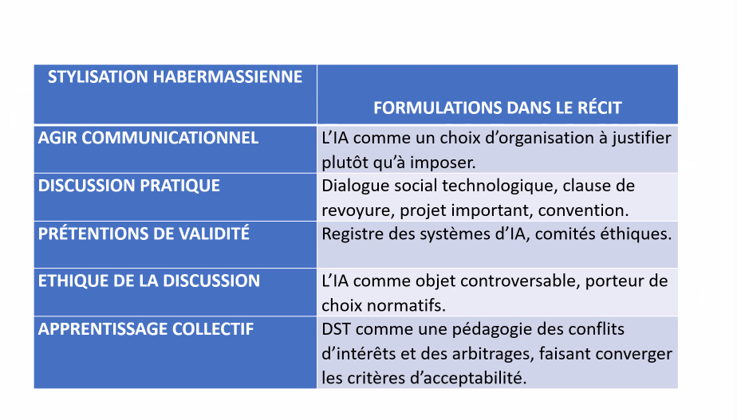
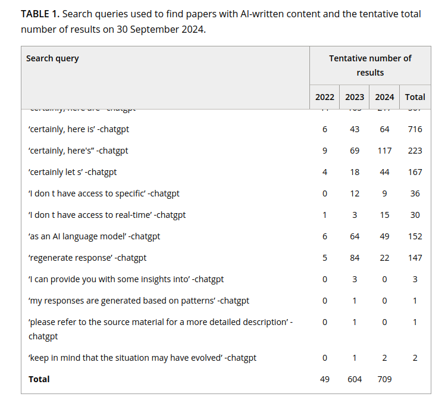
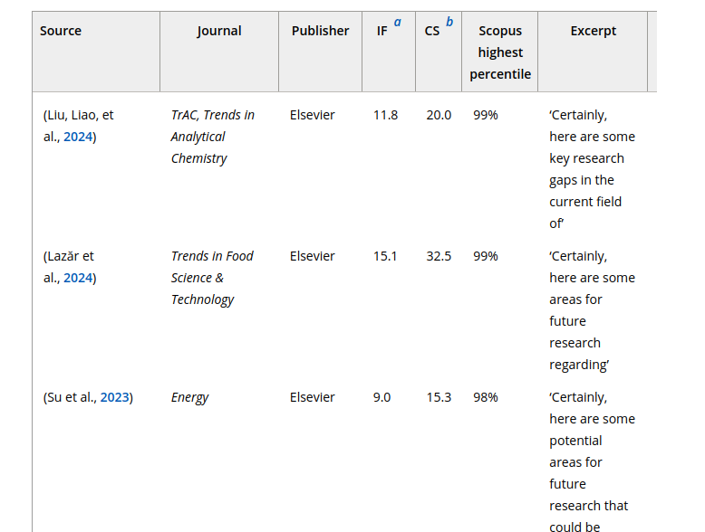
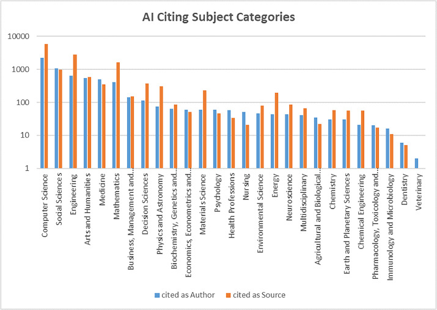

# Plan de la session

- Introduction
- Rappels
- Constat sur les nouvelles utilisations de l'IA
- Typologie des discours sur l'IA
- Positionnement des institutions
- L'IA auteur ? 
- Alternatives épistémiques 

## Présentation et objectif des ateliers 

Format : 4 séances de 2heures, sans inscription, participation libre (à justifier pour le certificat des Humanités Numériques)

Objectifs de la série d'atelier : 

- Comprendre les fondamentaux de l'IA et de son histoire
- Obtenir des notions critiques sur le fonctionnement profond des outils
- Cerner les enjeux actuels sur des thématiques qui affectent la recherche et l'enseignement

## Certificat canadien en Humanités Numériques

[Information sur le certificat](https://ccdhhn.ca/)

# Les fondamentaux : rappels 

## Qu'est ce que l'IA ? 
 
Des programmes informatiques que nous estimons à la hauteur de l'intelligence humaine? Le développement des technologies fait évoluer cette définition de l'_intelligence_ non seulement _artificielle_ mais aussi _humaine_.

'IA' depuis 5 ans, a remplacé le 'numérique' des années 2010, et le 'cyberespace' des années 1990 et 2000.[@vitali-rosatiManifestePourEtudes2025a]. 

Définition pratique pour ces ateliers: "automatisation de la cognition" @abbassEditorialWhatArtificial2021 pour "Transactions on Artificial Intelligence"

## Rappels : histoire de la discipline

- L'IA n'est pas une nouvelle discipline (terme de 1956 lors de la Dartmouth Summer Research Project on Artificial Intelligence par Marvin Minsky et John McCarthy). 
- L'article _Computing Machinery and Intelligence_ de @turingComputingMachineryIntelligence1950 a orienté la discipline vers la création de chatbots.
- Les 'saisons de l'IA' suivent des phases d'approbation publique et de désintérêt pour le terme et les technologies associées.
- Changement de paradigmes actuels : de l'outil qui assiste à l'outil qui produit à l'outil qui trompe (correction orthotypo -> reformulation -> génération -> masquage de son utilisation). 
- Ce qu'on fait entrer dans la catégorie d'"intelligent" a changé : le calcul savant est-il moins intelligent que le bavardage ? 

## Rappels : IA symbolique / IA connexionniste

- Deux grandes approches en IA : une approche déductive (IA symbolique, système expert) vs. approche inductive (IA connexionniste, modèle de langue basé sur des plongements de mots ou _embeddings_ = vecteurs). 
- Un LLM (_large language model_) est la modélisation sous forme de vecteurs de chaque élément d'un très grand corpus (_token_ ~mot) par rapport à cet ensemble. 
- Un système expert peut être aussi complexe et énergivore qu'un LLM.

## Rappel sur les LLMs 

- Chatbots type ChatGPT, Mistral, Gemini, Claude etc. = **application** qui utilise un LLM (la représentation figée de la langue en vecteurs) pour faire de la prédiction de tokens (génération) : aujourd'hui on parle d'architectures "agentiques" complexes avec plusieurs appels et interactions avant de traiter le prompt de l'utilisateur.ice.
- Absence de référent ou de règle : probabilité pure -> plausible et convaincant.
- Les hallucinations =/= anomalies. 
- Les outils reflètent les intérêts et la vision du monde de ceux qui les concoivent: correcteurs orthographiques et grammaticaux incarnent une vision du monde centrée sur la productivité et la rapidité.
- Exploitation des capacités inductives d'un LLM ne dépend pas d'une interface en langue naturelle. Le problème de la "blank box" [@tayBlankBoxProblem2026] Ex : classification avec de l'apprentissage machine (_machine learning_). 

# Constat

## _Shadow AI_

_Shadow IA_: Adoption et utilisation de l'IA dite générative sans approbation ou validation des personnes en charge. 

> Shadow AI is the unsanctioned use of any artificial intelligence (AI) tool or application by employees or end users without the formal approval or oversight of the information technology (IT) department.
> --- Source: https://www.ibm.com/think/topics/shadow-ai

> Statistique Canada indique que ces outils sont surtout utilisés pour l’analyse textuelle (35,7 %), l’analyse de données (26,4 %) et le déploiement d’agents conversationnels, comme les robots de clavardage (24,8 %).
> --- Source: 
https://theconversation.com/pres-de-80-des-travailleurs-canadiens-utilisent-lia-sans-cadre-institutionnel-251668

## "Pratiques discrètes du numérique" 

F. Clavert et C. Muller : avec le numérique certaines pratiques ne sont pas ou plus documentées (comment nous arrivons à une information, comment nous organisons nos données localement etc.) 
[@mullerTerritoiresLhistoireRecherche2025]

## Quelles nouvelles pratiques dans la recherche ?

::: {.incremental}

- production et examinuation d'un corpus :
  - _pipeline_ décomposée, traçable en partie (scrapping, nettoyage, OCR/HTR, nettoyage et structuration de la donnée, analyse) 
  - numérisation et nettoyage des données simultanément [@chagueDifferentsOutilsMeme2026]
  - production des questions de recherche et analyse simultanée, nouveau ?

- correction, reformulation : 
  - relecture humaine (imprimer son texte)
  - correction experte 
  - reformulation
  - cacher l'utilisation de l'IA générative, nouveau ? 

- demande de subvention:
  - ne pas créditer son assistant de recherche 
  - ne pas créditer ChatGPT, nouveau ?

- évaluation par les pairs:
  - pas de commentaire
  - "Voici l'évaluation de la proposition d'article : ", nouveau ?

:::

## Nouveauté ou exacerbation ?

Pourquoi cet outil nous bouleverse et qu'est-ce que cet outil bouleverse ? 

Remise en question de la superiorité humaine ?

**=> Cerner son positionnement idéologique et narratif.** 

# Typologie des discours autour de l'IA 

## _Un_ discours marketing ?

**Discours utilitariste** : l'IA c'est merveilleux, ne pensez plus. 

<iframe width="1000" height="500" src="https://www.youtube.com/embed/Rz3LD7u2KX8?si=VP_PMkJDX_CWbb7s" title="YouTube video player" frameborder="0" allow="accelerometer; autoplay; clipboard-write; encrypted-media; gyroscope; picture-in-picture; web-share" referrerpolicy="strict-origin-when-cross-origin" allowfullscreen></iframe>

> We built Cluely so you never have to think alone again. 
> It sees your screen. Hears your audio. Feeds you answers in real time.
> While others guess — you're already right.

**Discours hyper niche** : 

> today, soc 2 is done before your ai girlfriend breaks up with you. it’s done in delve.

**Économie de l'attention**:

"Intelligence Artificielle" terme inventé pour une **demande de subvention**. 

Donald Boat et Donald Trump sont dans le même bateau:

[Source @boatDOGPILEDONALDBOAT2025](https://donaldboat.substack.com/p/dogpile-the-donald-boat-story)

https://x.com/chiweethedog/status/2024761075900789191?s=20

> He’d generated a brutally simplified miniature of the entire VC economy. People were giving him stuff for no reason except that Altman had already done it, and they didn’t want to be left out of the trend.
> --- @krissChildsPlayTechs2025

## Les discours de l'IA sont au coeur d'une économie de la promesse.

## Quel discours tout court ?

Discours spéculatifs : "rationalistes" de Scott Alexander, catastrophisme de Yoshua Bengio, accélérationisme de la Big Tech etc.

_un_ discours "critique" ?

_un_ discours normatif ? 

## @benbouzidQuatreNuancesRegulation2022 : 4 arènes normatives 

- posture transhumaniste et spéculative 
- l’auto-responsabilisation des chercheurs développant une science régulatoire 
- la critique des effets néfastes des systèmes d’IA sur les droits fondamentaux
- régulations du marché

## @fergusonDarwinPrometheeTaylor2026 : Les figures narratives : construction du discours sur l'IA

Reprenant Benbouzid et Cardon : orientation des discours selon 2 axes:

- Axe agentivité des systèmes d'IA. Du techno-centrisme à la technologie comme construction sociale.
- Axe capital - travail. De l'accumulation du capital à la transformation du travail. 

Dont découlent 4 types de discours : 

- posture Darwinienne : Ne faites pas d'études supérieure
- posture promothéenne : l'IA est une création 
- narratif taylorien : l'IA est une manière de gagner en contrôle dans une logique productiviste
- narratif Habernassienne : co-construction _avec_ des systèmes d'IA 

---

## Posture darwinienne

Mise en concurrence entre l'humain et l'IA. L'humain doit renforcer ses compétences propres. Avec une forme d'agnostisme social et objectivité dans l'impact de l'IA sur le travail.

## Posture promothéenne 

"renaissance", les cyborgs, les centaures, les hybridations avec la machine promettent à l'humain des capacités sur-humaines, une libération. 

## Posture taylorienne

L'IA est une manière de gagner en contrôle et pas en productivité. Rationalisation scientifique, mise à distance critique. Lecture de l'IA dans une continuité. 
Ex: les diapos précédentes

## Posture habernassienne 

Co-construction des système d'IA : ex : prise de décision collective etc.
L'IA comme choix d'organisation à justifier, comme objet controversé. Paradigme émergent et pas encore dominant.
Le cadrage est celui du : il y a un bon discours sur l'IA. 

## Situation personnnelle

Narratif darwinien:

- inévitabilité de l'IA
- mise en concurrence des humains entre eux renforcé par les IA

Narratif prométhéen:

- ...

Narratif taylorien : 

- l'IA ne fait qu'exacerber les structures de contrôle,

Narratif habernassien: 

- [@schaferRepairingAIHow2025] se baser sur le breakage, repair, renew framework de @jacksonRethinkingRepair2014 : importance des guidelines pour la literatie numérique mais aussi importance du dialogue avec les média grand public pour entrer dans une logique de réparation, de mise en évidence des dégâts, et actuellement, une phase de "renouveau" au sens où la démocratie peut entrer en coopération avec la technologie.
- sensibilisation, formation.

# Où vous situez-vous ?
 
# Positionnement et préconisations des institutions

## _AI fairness_

Anticipation des risques = prolifération des chartes et rapports. 

Une trentaine de définitions actuellement. 

Communautés voire disciplines : Fair Machine Learning (Fair ML) et Explainable AI (XAI)

[@benbouzidControlerIA2022] : **principalisme** :

> les cadres moraux théoriques sont produits de manière déductive à partir de principes abstraits, puis appliqués aux pratiques. Il est reproché au principalisme de ne pas prendre suffisamment en compte les particularités de ces algorithmes et le contexte de leur mise en oeuvre.

Crenshaw : **intersectionalité** -> traiter différemment des choses ou groupes de population différentes peut mener à des inégalités et discriminations de la même manière que traiter tout le monde indifféremment. 

**Le discours des chartes invisibilise le besoin de prendre en compte la diversité de point de vue situé : une éthicisation des impacts de l'IA par des outils gestionnaires et techniques.** [@marquesPenserDiscriminationsLere2026]

## "Institutionnalisation"

> Pour une institutionnalisation efficace de l’IAG, nous proposons trois points complémentaires.

>-  L’élaboration de politiques d’utilisation explicites, communiquées et régulièrement mises à jour, permet de clarifier les frontières entre usages autorisés et proscrits.
> - La formation et la sensibilisation constituent des leviers essentiels : les employés doivent développer non seulement des compétences techniques en matière de rédactique, mais également une compréhension profonde des enjeux organisationnels, éthiques et de sécurité.
> - **Le choix et la mise en place d’outils d’IAG approuvés et sécurisés, notamment alignés sur les besoins de l’entreprise et sur la loi**. Comme le souligne KPMG, les organisations avant-gardistes « transforment l’utilisation non autorisée de l’IA en un avantage stratégique et en un moteur d’innovation » (traduction libre).

> --- @agbonPres80Travailleurs2026

Est-ce que la justice sociale définie le techno-langage ou est-ce l'inverse ?  

## Organisations supra-nationales 

Ex: Parlement européen, Assemblée parlementaire du Conseil de l’Europe, l’agence européenne des droits fondamentaux (FRA), l’Organisation pour la Sécurité et la Coopération en Europe (OSCE), le Partenariat Mondial pour l’Intelligence Artificiel (PMIA), la Banque Mondiale ou l’Organisation Mondiale de la Santé (OMS). 

Rapports puis lois 

ex: Artificial Intelligence Act de juin 2024. @RegulationEU20242024

## Le gouvernement canadien 

**Léglislation : Artificial Intelligence and Data Act (2022-2024)**

Controversé car jugé insuffisant dans les mesures de protection du public et des employés. Rejeté en 2024. 

Code de conduite volontaire visant un développement et une gestion responsables des systèmes d'IA générative avancés, 2023. 

-> Responsabilisation des individus et entreprises sur la base du volontariat, quelle efficacité face aux grandes entreprises ? 

**Guide sur l'utilisation de l'IA générative**

Canada:  [Guide sur l’utilisation de l’intelligence artificielle générative.](https://www.canada.ca/fr/gouvernement/systeme/gouvernement-numerique/innovations-gouvernementales-numeriques/utilisation-responsable-ai/guide-utilisation-intelligence-artificielle-generative.html) (2024, mai 30).

-> à destination des institutions fédérales

Typologie des usages à risque:

>Les risques liés à l’utilisation de ces outils dépendent de ce à quoi ils serviront et des mesures d’atténuation en place.

>Exemples d’utilisations à faible risque :

>- rédiger un courriel pour inviter des collègues à une activité de renforcement de l’esprit d’équipe;
>- réviser l’ébauche d’un document qui fera l’objet d’examens et d’approbations supplémentaires.

> Exemples d’utilisations à risque plus élevé (comme les utilisations dans la prestation de services) :

>- déployer un outil (par exemple, un robot conversationnel) à l’intention du public;
>- produire un résumé des renseignements d’un client.

Principes PRETES:

- Pertinente
- Responsable
- Équitable
- Transparente
- Éclairée
- Sécurisée

>Pratiques exemplaires pour tous les utilisateurs de l’IA générative dans les institutions fédérales

>- **Indiquer clairement que vous avez utilisé l’IA générative pour élaborer du contenu.**
>- **Ne pas considérer le contenu généré comme faisant autorité.** Vérifier l’exactitude des faits et du contexte, par exemple en les comparant à des renseignements provenant de sources fiables ou en demandant à un collègue ayant de l’expertise d’examiner la réponse.
>- Vérifier les renseignements personnels créés à l’aide de l’IA générative afin de veiller à ce qu’ils soient exacts, à jour et complets.
>- Évaluer l’incidence des résultats inexacts. Ne pas utiliser l’IA générative lorsque l’exactitude des faits ou l’intégrité des données est nécessaire.
- S’efforcer de comprendre la qualité et la source des données d’apprentissage.
>- **Penser à votre capacité à relever les contenus inexacts avant d’utiliser l’IA générative. Ne pas l’utiliser si vous ne pouvez pas confirmer la qualité du contenu.**
>- Apprendre à créer des messages-guides efficaces et à fournir un retour d’information pour affiner les résultats afin de limiter la production de contenu inexact.
>- **N’utilisez pas d’outils d’IA générative comme moteurs de recherche à moins que des sources soient fournies pour que vous puissiez vérifier le contenu.**

[@secretariatduconseildutresorducanadaGuideLutilisationLintelligence2024]

### Conseil consultatif en matière d'intelligence artificielle
 
Depuis 2019. 

Orientation du conseil à l'été 2025: 

> les membres du Conseil ont souligné l'intérêt de **réutiliser les outils au code source ouvert**, de **mesurer l'impact de l'IA** et de déployer à l'échelle du gouvernement les applications qui ont fait leurs preuves afin d'**éviter de réinventer la roue**. Ils ont également suggéré que le gouvernement aurait tout intérêt à **renforcer sa collaboration avec le secteur privé** pour mettre en œuvre la stratégie, mais que cela nécessiterait le retrait de certains obstacles, tels que la complexité des règles d'approvisionnement.

>  « L'IA pour la prospérité », qui met l'accent sur l'adoption, l'intersection entre l'IA et l'énergie, et l'inclusion numérique.

[@conseilconsultatifenmatieredintelligenceartificielleResumesReunionConseil2025]

### Stratégie pancanadienne en matière d'IA

3 pilliers : 

- Commercialisation (appui aux instituts nationaux comme le MILA)
- Normes 
- Talents et recherche (via CIFAR)

## Les entreprises

@dubberOxfordHandbookEthics2020 : 

- un écart entre la preuve de concept, le prototype et le déploiement de grande échelle
- possibilité de régulation de l'infrastructure industrielle vs. régulation des services permis par cette infrastructure (ex: banque, compagnies aériennes)
- modèles alternatifs comme Wikipédia peuvent (grâce à l'anonymat) limiter les incitatifs à l'autopromo. 

> guardrail failures are features not bugs: they are created by the incentives built into the algorithm. 

Ex: les "phantom requests" sur über, sans possibilité de recours, baissent les notes des chauffeur.se.s qui perdent leurs bonus. über se défend en maintenant le discours du 'bug'. 

> The pairing of the algorithms and guardrails tempts companies to engage in regulatory arbitrage, providing a requirement for external action. 

--- @dubberOxfordHandbookEthics2020

-> risques d'ingérences politiques accru avec l'invisibilisation et l'adoption massive de systèmes d'IA propriétaires.

## Universités 

**Udem** 

- Une boîte à outils et des formations : https://boite-outils.bib.umontreal.ca/trouver-evaluer/iag

- Un propos fort et répété:

> Il est important de consulter les plans de cours pour vérifier si l’utilisation des outils d’IAg est permise et les modalités d’utilisation qui sont acceptées. Sans autorisation explicite, ces outils sont réputés interdits.

**Université de Liège**

Usages permis:

- assistant linguistique
- assistant de recherche d'information

> Il va de soi que votre université vous encourage par ailleurs à exploiter l’IA, dans votre sphère personnelle, pour accompagner votre étude et consolider votre maitrise des matières !

Usages proscrits: 

>Présenter la production d'une IA comme la sienne propre ou celle d'un condisciple car ce faisant: 
> - vous vous appropriez malhonnêtement le travail d’autrui ou vous ignorez les sources vraies qui ont conduit au résultat présenté. 
> - vous développez une forme de paresse intellectuelle 
> - vous empêchez l’enseignant d’évaluer correctement les connaissances, compétences, attitudes que le travail est censé refléter.

@universitedeliegeCharteULiegeDutilisation2023

<!-- Limite : compliqué de se faire une expertise grâce à l'IA tout en restant critique de l'IA sans expertise ...  -->

## Éditeurs

Springer et Elsevier depuis septembre 2025 distinguent une utilisation par les auteur.ice.s et une utilisation par les évaluateur.ice.s. : 

- Auteur.ice : utilisation autorisée pour la correction plus ou moins mineure du texte, sans définition claire entre correction et édition.

> "AI assisted copy editing" as AI-assisted improvements to human-generated texts for readability and style, and to ensure that the texts are free of errors in grammar, spelling, punctuation and tone. These AI-assisted improvements may include wording and formatting changes to the texts, but do not include generative editorial work and autonomous content creation. In all cases, there must be human accountability for the final version of the text and agreement from the authors that the edits reflect their original work.
> --- Springer 

- Attribution autoriale : doit rester strictement humaine

> Authors preparing a manuscript for an Elsevier journal can use AI Tools to support them. However, these tools must never be used as a substitute for human critical thinking, expertise and evaluation. AI Tools should always be applied with human oversight and control.
> --- Elsevier

- Interdiction totale pour l'aide à l'évaluation : 

> **Reviewers should not upload a submitted manuscript or any part of it into a generative AI tool as this may violate the authors’ confidentiality and proprietary rights and, where the paper contains personally identifiable information, may breach data privacy rights.**

> This confidentiality requirement extends to the peer review report, as it may contain confidential information about the manuscript and/or the authors. For this reason, reviewers should not upload their peer review report into an AI tool, even if it is just for the purpose of improving language and readability.

## Citer l'IA 

Guidelines de la MLA, Chicago et APA pour citer l'utilisation de l'IA. 

Pourtant, traces de "Shadow AI" ou "pratiques discrètes"  @strzeleckiMyLastKnowledge2025 : 

<!--  -->

vs. @gorraizAcknowledgingNewInvisible2025 : utilisation de moins en moins invisibilisée des IA. 

- recherche d'articles dans WoS et Scopus jusqu'à oct. 2024 avec "openAi, ChatGPT et Perplexity".
- 12 articles listent un des 3 termes comme co-auteur.
- présence dans la bibliographie et dans les remerciements :
  - on cite plus souvent "openAI" que "ChatGPT"
  - 816 citations bibliographiques, soit comme auteur, soit comme source (ex: Anonyme, 2024). 
  - Observation du type de citation par discipline montre les divergence de perception de l'IA : 
    
> The predominance of citations listing AI as an author in Computer Science and Social Sciences suggests that AI is becoming an active contributor to content generation within these fields.
> On the other hand, the trend of citing AI more frequently as a source in Environmental Science and Earth and Planetary Sciences indicates that AI’s role in these disciplines is more focused on data analysis rather than content creation. 
> This variation in citation practices across disciplines highlights AI’s evolving role. **Some fields seem to lean toward acknowledging AI as a source of information, while others are increasingly embracing AI as a formal co-author.**

--- 

--- 

## Citer l'IA : limites  

@gorraizAcknowledgingNewInvisible2025 : 

- subvertion du principe de la citation qui est une reconnaissance du travail d'un collègue "sur les épaules d'un géant"
- contradiction avec l'interdiction de reconnaissance de l'autorialité des IA.
- suggère plutôt de se servir des remerciements
- aucune assurance que les auteur.ice.s suivent les exigences de transparence des revues etc.

## Question épineuse de l'attribution autoriale 

Positionnement clair du @committeeonpublicationethicsAuthorshipAITools2024 : 

> AI tools cannot be listed as an author of a paper.

> Authors should not list AI Tools as an author or co-author, nor cite AI Tools as an author. Authorship implies responsibilities and tasks that can only be attributed to and performed by humans
> --- Elsevier

vs. une nouvelle pratique : ex @generativepre-trainedtransformerRapamycinContextPascals2022 : a modifié la liste de co-auteur pour mentionner seulement Zhavoronkov. 

## Quelles alternatives épistémiques pour l'IA ? 

@marquesPenserDiscriminationsLere2026 concevoir des systèmes d'IA "avec" et non "pour".

- [Masakhane]("https://www.masakhane.io/) : traduction automatique des langues africaines.
- [Código Não Binário]("https://codigonaobinario.org/")

Perspective Humanités Numériques : 

> « Can we conceive of models of interface that are genuine instruments for research? That are not merely queries within pre-set data that search and sort according to an immutable agenda? How can we imagine an interface that allows content modeling, intellectual argument, rhetorical engagement? » 
> --- [@druckerPerformativeMaterialityTheoretical2013]

_Provotype_ [@boerProvotypesParticipatoryInnovation2012]

Les Études critiques de l'IA : 
- comprendre les algorithmes
- cerner l'impact sociétal et les discours sur l'IA

## Bibliographie