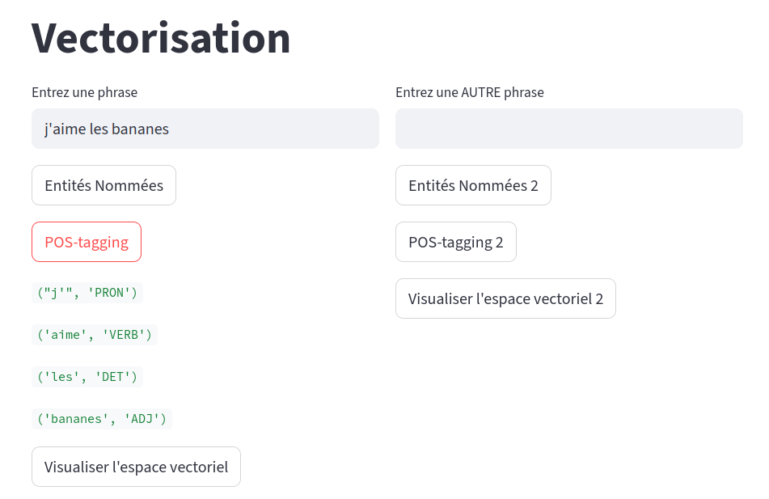
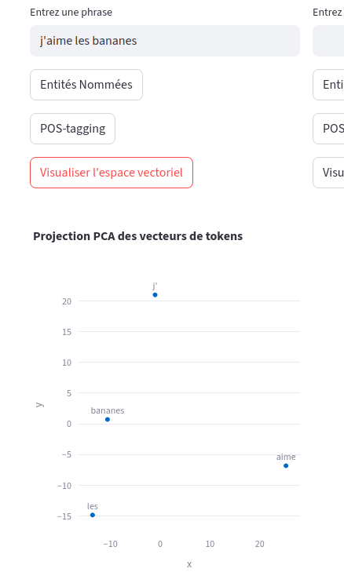

# Séance 1 : Introduction à l'IA pour les SHS et fonctionnement et place des chatbots

**Date : 11 septembre**

## Plan 

(format de 2h)
1. Présentation de la série d'atelier 
2. Qu'est-ce que l'IA ? 
3. Intérêt d'étudier l'IA pour les SHS
4. Retours historiques
5. Typologie des IA
6. Cas d'usage et modélisation experte (ELIZA)
7. Cas d'usage et modélisation distributionnelle/vectorielle (vectorisation et prédiction)
8. Les LLMs
9. Usages des LLMs hors chatbots ()
10. LLMs et chatbots (Ollama)
11. Conclusions

# Présentation et objectif des ateliers 

Format : 4 séances de 2heures, sans inscription, participation libre (à justifier pour le certificat des Humanités Numériques)

1h à 1h30 de théorie + 30 minutes à 1h de pratique.

Objectifs de la série d'atelier : 

- Comprendre les fondamentaux de l'IA et son histoire
- Obtenir des notions critiques sur le fonctionnement profond des outils
- Tester et s'approprier des outils d'IA 
- Maîtriser le vocabulaire de la discipline


# Qu'est ce que l'IA ? 

Tout 

et rien. 

-> collage : chatbot, classifications d'imageries médicales, HTR, DeepBlue. 

- le dernier mot à la mode. Le 'numérique' des années 2020. [@vitali-rosatiManifestePourEtudes2025]. 

- un programme informatique qui effectue une prédiction. 

# L'IA en SHS
<!-- motto possible ; 
Ne vous demandez pas ce que l'IA peut faire pour vous, mais plutôt ce que vous pouvez faire pour l'IA.  -->

Que peuvent faire les SHS pour l'IA ? 

- participer à la réflexion actuelle sur son utilisation : 
    - positionnements de revues et de conférences sur son utilisation (pose un cadre, parfois un précédent)
- proposer une théorie critiques de l'IA décentrées de l'effet 'benchmarking' (pure comparaison des outils qui évoluent trop vite de toute façon) : offrir une vision propre à sa discipline.

## Exemples de prises de position 

>Both SUP and JHUP have increasingly embraced, tested, and deployed some AI tools and policies. Barbara has been clear in her support of responsible uses of AI and the necessity of leveraging these early days to stake a claim within the quickly evolving landscape. Like SUP, JHUP is building and testing its own tools for marketing, accessibility, and analytics, efforts which place our presses in a position to potentially build services that might in the future even benefit other university presses. [@mulliken2025AUPressesWeekinResidence2025]

>we offer recommendations for citing generative AI, defined as a tool that “can analyze or summarize content from a huge set of information, including web pages, books and other writing available on the internet, and use that data to create original new content” (Weed). [@HowCiteGenerative2023]

> The uncomfortable truth for researchers and publishers who oppose AI slowly taking over human review is that they might not be able to prevent it. Should a researcher use AI to write the first pass of peer review and not disclose it — in contravention of publisher guidelines — that might not be detectable, says Hosseini, who is also one of the editors of the journal Accountability in Research. And if AI reviews become widespread, that could change the practice of science, says Priem. “Every researcher can run their own bespoke review service over the preprint/dataset landscape, flagging/extracting only the science they care about (at any “quality” level) they want that day,” he wrote on X earlier this year. That could start to eat into the roles of journals, by taking away the certification that peer review mediated by journals provides, he says.
[@naddafAITransformingPeer2025]


# Brève histoire de l'IA et des applications de linguistique computationnelle

1940s : Science-fiction et roman d'Isaac Asimov _Runaround_ en 1942. 

@turingComputingMachineryIntelligence1950 : 'can machines think?'

'intelligence artificielle' : 1956 

>« The word Artificial Intelligence was then officially coined about six years later, when in 1956 Marvin Minsky and John McCarthy (a computer scientist at Stanford) hosted the approximately eight-week-long Dartmouth Summer Research Project on Artificial Intelligence (DSRPAI) at Dartmouth College in New Hampshire. » [@haenleinBriefHistoryArtificial2019, p. 7]


1966 : ELIZA @weizenbaumELIZAComputerProgram1966 

1990-2000s : pic des systèmes experts et des arbres de décision. DeepBlue d'IBM [@campbellDeepBlue2002]. 

2010s : pic des systèmes d'IA avec une modélisation distributionnelle du language (vecteur). Word2Vec [@mikolovEfficientEstimationWord2013], GloVE [@penningtonGloVeGlobalVectors2014]. Parmi les avancées majeures de cette modélisation on compte le mécanisme d'attention @vaswaniAttentionAllYou2017 et l'encodage bidirectionnel BERT [@devlinBERTPretrainingDeep2019] qui permettent des modèles très performants comme le GPT-3 d'OpenAI [@brownLanguageModelsAre2020]. 

Actuellement : tendance à l'hybridation [@marcusNextDecadeAI2020]

# Ce qu'il faut retenir de l'histoire de l'IA

- deux modélisations : une approche top-down et une approche sample-based (voir suite). 
- 'des saisons' en IA càd que certaines approches attirent l'attention à un moment donné, actuellement IA = ChatGPT. 
- l'IA réfère à des technologies variées et pas seulement à des programmes de génération textuelle. 


# Typologie de l'IA 

Approche "top-down"

Approche "bottom-up"


# Entrons dans le vif du sujet : exemple d'IA 

Exemple classification de texte (classification binaire, fruit/non fruit) ou détection de spam ?

**'J'aime les bananes'**

## Modéliser une approche experte 

- faire appel à un expert : un humain pour déterminer les règles qui définissent ce qui est une phrase parlant de fruits. 
- exemple de règle possible : liste de mots comme 'pomme, pommes, banane, poire etc.' ordre des mots ou POS pour distinguer 'orange' couleur du fruit par exemple. 

Une approche qui sembler simpliste en apparence mais qui : 

- peut s'avérer très complexe (ex: traduction)
- est la base de systèmes très performants 
- entre dans une logique de lazy computing [@fujinagaVirtuesLazyMachines2025]
- révèle les tâches de bas niveau pour passer d'une chaîne de caractères à un ensemble de caractéristiques : tokenisation, POS-tagging. 

-> une logique _top-down_

### Exemple d'un programme conversationnel /génération textuelle avec une approche experte ELIZA

Try it yourself : 
https://anthay.github.io/eliza.html 

"Eliza is a pattern-matching automated psychiatrist. Given a set of rules in the form of input/output patterns, Eliza will attempt to recognize user input phrases and generate relevant psychobabble responses.

Each rule is specified by an input pattern and a list of output patterns. A pattern is a sentence consisting of space-separated words and variables." https://dhconnelly.com/paip-python/docs/paip/eliza.html 


Exemple de _literate programming_ [@knuthLiterateProgramming1984] : 

https://dhconnelly.com/paip-python/docs/paip/eliza.html


## Modélisation vectorielle et machine learning

- partir d'un ensemble important d'exemples
- travail d'annotation par un humain/expert: _ground truth_ ou vérité de terrain.
- 1 token = une caractéristique
- comptage des tokens dans l'ensemble du jeu de données et dans chaque phrase/document. 
- représentation vectorielle = coordonnées dans un espace vectoriel à _n_ dimensions.





Visualisation de traitement basique (NER, POS et vectorisation)

<!-- PROGRAMME TOKEN_CLASSIFICATION À DEPLOYER  -->


- même traitement est effectué sur de nouvelles données
- différentes logiques pour classer la nouvelle donnée : 
    - K-Nearest Neighbor
    - Regression logistique

Points forts : 

- adaptable à des nouvelles données, notamment avec une tokenisation fragmentée

## Les LLMs 

Exemple de LLMs : GPT-4, Mixtral, Gemini, Llama, Qwen, DeepSeek etc. 

Large Language Models : 
1. modélisation vectorielle de chaque mot de la langue par rapport à sa fréquence d'apparition en contexte avec chacun des autres mots de la langue, 
2. spécialisation sous forme de couche neuronale pour une tâche ou une fonction précise. 
3. query et calcul pour chaque donnée en entrée du token le plus probable en sortie


# LLMs et non chatbot

Classification (de token, de texte)


<!-- démo NER -->


# LLMs et chatbot

Parce que les LLMs sont lourds (plusieurs Gigas) et parce qu'il est coûteux en énergie d'effectuer les calculs qui permettent de déterminer le prochain token (plusieurs GPU), l'usage le plus courant des LLMs est via un site qui va interroger le modèle sur un serveur distant. C'est la forme ChatGPT, Mistral.ai, etc. 


## Duck.ai

duck.ai permet de comparer des modèles en interfaces chat tout en conservant des données privées : https://duck.ai

<!-- démonstration de duckai et des paramètres -->


## Ollama
Il est pourtant possible de faire tourner un SLM (small language model) localement. Pour ce faire : `ollama` est une bibliothèque qui permet de télécharger et d'utiliser localement un LLMs. 


### téléchargement
https://ollama.com/download

command line 

ollama run llama3.2

""" -> pour des instructions longues

ollama list -> liste des modèles téléchargés et utilisables

ollama rm llama3.2 -> supprime un modèle 


## Paramètres d'un modèle 

Plusieurs paramètres importants et contrôlable : 

- le seed :les LLMs ont une variable aléatoire dans leur paramètre : le seed permet d'utiliser toujours le même ordre aléatoire, càd d'obtenir pour un même prompt toujours la même réponse et ainsi de rendre reproductible une réponse. 
- la température: détermine le degré d'utilisation de la variable aléatoire (mas o menos)
- top_k : Reduces the probability of generating nonsense. A higher value (e.g. 100) will give more diverse answers, while a lower value (e.g. 10) will be more conservative. (Default: 40)
- top_p: Works together with top-k. A higher value (e.g., 0.95) will lead to more diverse text, while a lower value (e.g., 0.5) will generate more focused and conservative text. (Default: 0.9)

## model Steering 

https://github.com/ollama/ollama/blob/main/docs/modelfile.md

 Créer un nouveau document 'Modelfile' sans extension
 `touch Modelfile`

 ```
FROM llama3.2
PARAMETER temperature 1
top_k 100
top_p 1
seed 17
SYSTEM "Tu es un chien"
```

ollama create chien -f Modelfile

ollama run chien


## Limites des interfaces de chat 

- les chatbots ont des limites : on peut 'hacker un LLM' avec du _prompt injection_ ou autres techniques de _Jailbreaking_. 

https://incidentdatabase.ai/ 

ex : https://incidentdatabase.ai/cite/1135 : Hidden prompts reportedly were discovered in at least 17 academic preprints on arXiv that purportedly instructed AI tools to deliver only positive peer reviews. The lead authors are reportedly affiliated with 14 institutions in eight countries, including Waseda University, KAIST, Peking University, and the University of Washington. The alleged concealed instructions, some of which were reportedly embedded using white text or tiny fonts, were purportedly intended to influence any reviewers who rely on AI tools.


<!-- Exemples de prompt injections et de cas récents de détournement.  -->

- il n'y a pas d'hallucinations, toutes les générations produites par un LLMs ont la même teneur de vérité du pdv de l'outil : le modèle ne peut pas évaluer sa réponse à l'aune d'une _ground truth_ comme dans sa phase d'entraînement.


- Problèmes et réflexions pour les SHS : 
    - uniformisation des pratiques, des modes de pensées : l'interface de chat est une façon de formaliser son problème, quid de la recherhce de solution en interrogeant des moteurs de recherche, des bdd ou archives spécialisées ? 

    - Derrière l'apparente accessibilité de l'interface de chat, est-ce qu'on ne risque pas de creuser l'écart de la littératie numérique ? 

    - Est-ce que ces connaissances spécifiques, comme celles du code, qui impliquent des capacités de raisonnement alternatives, ne risquent pas de se retrouver suelement dans une forme d'élite intellectuelle ? 


# Ce qu'il faut retenir de la séance

- l'IA est un terme ajd employé à tort poru parler des LLMs mais qui recouvre en réalité des processus algorithmiques variés et pas seulement des chatbots type ChatGPT.
- l'histoire de l'IA a montré qu'il y a des phases
- les autres systèmes ne sont pas plus ni moins 'intelligent'. 
- un système expert peut être aussi complexe et énergivore que du machine learning (mais dans les faits plus rarement).
- les systèmes d'IA n'ont pas de connaissance du réel (et celleux qui disent le contraire essaient de vendre des choses à l'heure actuelle)
- par csq les halllucinations ne sont pas des anomalies, ce sont des erreurs que l'on qualifie a postériori comme telle. 
- les systèmes inductifs sont appropriés pour des certaines tâches : classification, production de résumé. Leur point fort reste l'adaptation à des contextes de textes ou d'images variés. 
- les chatbots sont des interfaces qui permettent un échange homme-machine en langue naturelle : l'exploitation des capacités inductives d'un LLMs ne nécessite pas de passer par une telle interface. Ex : classification, processus expérimental plus adapté à une utilisation sans cette interface. 

# Ressources vues pendant l'atelier

https://spacy.io/usage 

https://incidentdatabase.ai/

https://duck.ai

Ollama
    Installation : https://ollama.com/download
    Documentation : 
    https://github.com/ollama/ollama/blob/main/docs/modelfile.md


# Références